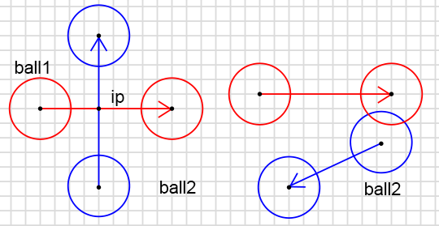
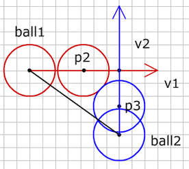
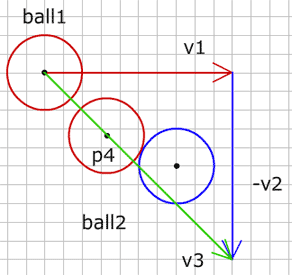
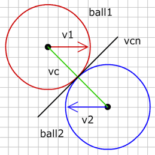
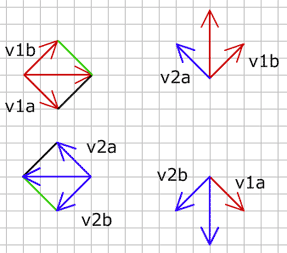

# 2 개의 움직이는 공 (2 moving balls)

그래서, 세상의 경의로운 것들을 탐험하고 찾아갈 수 있기 때문에 아마도  움직이는 공은 이미 가장 기쁠 것입니다. 그런데 다른 공이 한 곳에 서 있기를 중단하기로 결심하고 움직이기 시작한다면 어떤 일이 벌어질까요? 그 공은 그렇게 할 모든 권리를 가지고 있습니다. 이런 경우 우리의 충돌은 실패할 것입니다. 몇가지 예시를 보세요:

공1 이 빨강 벡터 만큼 움직이고, 같은 시간 공2 는 파랑 벡터의 크기만큼 움직입니다. 충돌을 올바르게 검출하고자 한다면 두 운동벡터를 같이 계산해야 합니다.

그림에서 두 공이 충돌할 때 공1이 p2점에 도달하고 공 2가 p3 점에 있습니다. 우리는 벡터를 쉽게 더할 수 있기 때문에 벡터를 사용하는 것은 매우 좋습니다. 그렇다면, 두 움직이는 공의 충돌을 찾는 대신에, 공 1의 운동벡터에서 공2 의 운동벡터를 뺍니다. 그러면 지난 단계에서 움직이는 공과 움직이지 않는 공 충돌을 사용할 수 있습니다.

공1 운동벡터에서 공2 운동벡터를 뺀, 볼1을 시작 좌표로 하는 v3 벡터를 구합니다 :

  
v3={};
v3.p0=ball1.p0;
v3.vx=ball1.vx-ball2.vx;
v3.vy=ball1.vy-ball2.vy;


이제 지난 단계에서 배운 충돌 계산을 수행하면, 공1 은 벡터 v3 만큼 움직이고 공2 는 전혀 움직이지 않습니다. 공이 충돌하면 공1은 점 p4 좌표에 있습니다. 공1 의 운동벡터에서 그 점까지의 새로운 벡터 v4 를 구합니다 :

  
game.v4 = {p0: ball1.p0, p1: p4};


두 공이 같은 시간에 움직이고 있음을 알기 때문에, v4 길이를 v3 길이로 나눈 변수 "t" 를 구할 수 있습니다.

  
t=v4.len/v3.len;


변수 "t" 는 0 과 1 사이 입니다. 값이 1 이면 공1 이 끝점에 도달하였을 때 충돌이 일어납니다. 값이 0이면 공들이 시작점에 있을 때 충돌이 일어납니다. 충돌이 일어날때 공들의 위치를 알아내기 위해서 그들의 운동벡터에 t 곱해야 합니다.

  
ball1.p1.x=ball1.p0.x+t*ball1.vx;
ball1.p1.y=ball1.p0.y+t*ball1.vy;
ball2.p1.x=ball2.p0.x+t*ball2.vx;
ball2.p1.y=ball2.p0.y+t*ball2.vy;


그래서 moveBack 의 값만큼 p2에서 운동벡터 v의 반대방향으로 이동합니다. p3 가 벡터 v의 밖에 있는 것은 이번 운동 사이클 동안 충돌이 일어나지 않을 것이며, 과거에 일어났거나 미래에 일어날 것임을 의미합니다. 우리는 지금 충돌에 대해서만 다룰 것이기에 벡터 v 위에 p3 가 있는 것에 대해 검사해야 합니다 :

  
if(game.v3.len < ob.len && dotP(game.v3, ob) > 0){
  //collision
  game.ob1.p0 = game.p3;
}


제가 두 공이 움직이는 예제를 만들었습니다:

    <object classid="clsid:d27cdb6e-ae6d-11cf-96b8-444553540000" width="300" height="200" id="vect11" align="middle">
        <param name="movie" value="vect11.swf" />
        <param name="quality" value="high" />
        <param name="bgcolor" value="#ffffff" />
        <param name="play" value="true" />
        <param name="loop" value="true" />
        <param name="wmode" value="opaque" />
        <param name="scale" value="noborder" />
        <param name="menu" value="false" />
        <param name="devicefont" value="false" />
        <param name="salign" value="" />
        <param name="allowScriptAccess" value="sameDomain" />
        <!--[if !IE]>-->
        <object type="application/x-shockwave-flash" data="vect11.swf" width="300" height="200">
            <param name="movie" value="vect11.swf" />
            <param name="quality" value="high" />
            <param name="bgcolor" value="#ffffff" />
            <param name="play" value="true" />
            <param name="loop" value="true" />
            <param name="wmode" value="opaque" />
            <param name="scale" value="noborder" />
            <param name="menu" value="false" />
            <param name="devicefont" value="false" />
            <param name="salign" value="" />
            <param name="allowScriptAccess" value="sameDomain" />
        <!--<![endif]-->
            
        <!--[if !IE]>-->
        </object>
        <!--<![endif]-->
    </object>

공이나 벡터의 끝점들을 드래그할 수 있습니다.

소스 <a href="vect11.fla">fla</a>를 다운받을 수 있습니다. 

 

-----

 

# 2 개의 움직이는 공을 반동시키기 (Bouncing 2 moving balls)

충돌위치가 발견된 이후 "Ball vs ball" and "Bounce" 단계에서 설명한 것처럼 그것들의 운동 벡터를 변경할 수 있습니다. 그런데 지금까지 오직 1개 공을 움직였고, 1개 움직이는 공이 벽으로부터 같은 속도로 (단지 운동 방향이 바뀐 채) 반동했습니다. 두 공이 움직일 때, 그들의 움직임은 다른 공에 역시 영향을 주고 운동벡터 결과는 두 운동벡터로부터 다시 계산되어야 합니다.

반동은 두 공의 질량에 따라 달라집니다. 좀 간단히 만들기 위해 공들이 같은 질량을 갖고 있다고 가정합니다. 이런 경우 두 공들은 중심점 사이의 벡터 방향 상에 있는 운동벡터의 요소를 교환합니다.

vc 는 공들의 중심점 사이 벡터이고, vcn 은 vc 의 노말입니다. 이제 운동 벡터 v1 과 v2 를 vc 와 vcn 에 투영시킵니다 :

v1 은 v1a 와 v1b 요소로 분리되고, 같은 방법으로 v2는 v2a 와 v2b 로 분리됩니다. 결과 운동벡터를 구하기 위해 v1a 와 v2a 가 교환되어지고 공1 은 v1b 와 v2a 로부터 새로운 운동 벡터를 얻습니다. 반면 공2는 v1a 과 v2b 로부터 새로운 운동을 만듭니다.

그리고 이 예제에서 몇몇 공들이 움직이고 반동합니다 :

    <object classid="clsid:d27cdb6e-ae6d-11cf-96b8-444553540000" width="300" height="200" id="vect11a" align="middle">
        <param name="movie" value="vect11a.swf" />
        <param name="quality" value="high" />
        <param name="bgcolor" value="#ffffff" />
        <param name="play" value="true" />
        <param name="loop" value="true" />
        <param name="wmode" value="opaque" />
        <param name="scale" value="noborder" />
        <param name="menu" value="false" />
        <param name="devicefont" value="false" />
        <param name="salign" value="" />
        <param name="allowScriptAccess" value="sameDomain" />
        <!--[if !IE]>-->
        <object type="application/x-shockwave-flash" data="vect11a.swf" width="300" height="200">
            <param name="movie" value="vect11a.swf" />
            <param name="quality" value="high" />
            <param name="bgcolor" value="#ffffff" />
            <param name="play" value="true" />
            <param name="loop" value="true" />
            <param name="wmode" value="opaque" />
            <param name="scale" value="noborder" />
            <param name="menu" value="false" />
            <param name="devicefont" value="false" />
            <param name="salign" value="" />
            <param name="allowScriptAccess" value="sameDomain" />
        <!--<![endif]-->
            
        <!--[if !IE]>-->
        </object>
        <!--<![endif]-->
    </object>

소스 <a href="vect11a.fla">fla</a>를 다운받을 수 있습니다. 

 
 
다음 : [Ball vs Arc]({{ "/ball_vs_arc/" | prepend: site.baseurl }})

