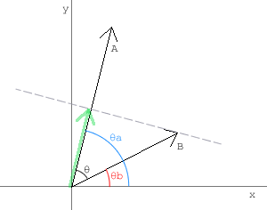

# 여러 개의 백터 다루기 (Dealing with multiple vectors)

한 개의 벡터를 다루는 것은 재밌을 수 있을 것입니다. 그러나 실제 한 개의 벡터만 다루는 일을 별로 없고, 두세개 혹은 더 많은 수의 벡터들을 다룹니다. 그래서 다수의 벡터를 다루는 방법을 알아야 합니다. 그렇지 않으면 당신의 제어 밖으로 벗어난 벡터들과 싸우는 일은 매우 지루할 것입니다.

무엇보다, 물체에 영향을 주는 벡터가 1개 이상인 일이 빈번합니다. 간단한 예가 중력입니다: 물체가 움직이고 있을 때, 동시에 중력은 오브젝트를 땅으로 끌어당기고 있습니다. 중력도 당연히 여타의 힘처럼 벡터로 선언할 수 있습니다(그것은 항상 땅 쪽으로 향하고 있고, 옆에서 보는 게임에서는 바로 아래 방향이 됩니다). 여기 2개의 벡터가 있고 그 결과 벡터를 구해야 오브젝트를 움직일 수 있습니다. 벡터를 더하기 위해서 벡터들의 vx, vy 속성을 각각 더합니다.

  
resultv = {};
resultv.vx = v1.vx + v2.vx;
resultv.vy = v1.vy + v2.vy;


그리고 보다 많은 벡터가 있다면, 같은 방법으로 벡터들을 더하면 됩니다.

>벡터를 더하고 뺄 때는 vx, vy 성분을 각각 더하고 빼면 된다.

 

------

 

# 투영 (Projection)

가끔식 2개의 벡터가 어떤 방향을 향하고 있는지 알면 유용합니다, 벡터가 같은 방향으로 오브젝트를 보내고 있는지 아니면 하나는 동쪽으로 다른 하나는 서쪽으로 향하고 있는지 알면 말입니다.


dp = v1.vx * v2.vx + v1.vy * v2.vy; 


우리는 두 벡터의 vx와 vy 속성끼리 곱한 다음 결과를 더합니다. 이 변수 dp를 '벡터 v1과 v2의 내적'이라고 부릅니다. dp는 벡터가 아니고 단지 숫자 입니다. 이 값이 양수이면 2개의 벡터는 같은 방향을 향하고 있고, 음수이면 서로 반대방향을 향하고 있는 것입니다.

>내적(Dot Product)은 A·B 으로 표시한다. 그리고 벡터 A, B 에 대한 내적의 정의는 이렇다.

    A·B = |A||B|cosθ

>θ는 두 벡터의 사이각이고 \|A\| 는 A 벡터의 크기이다. 식을 보면 내적은 A벡터의 크기와 벡터 B의 A방향 성분 크기를 곱한 값이다. 그래서 B 벡터가 A 벡터와 다른 방향이면 B 벡터의 A 방향 성분이 음수이기 때문에 내적이 음수가 나온다. 그리고 내적이 0 이면 직교한다는 것을 알 수 있다. 내적의 정의로부터 위에 나오는 식을 도출해보자.
>
>
>
>벡터 A, B 가 사이각 θ 를 두고 있다. θ 는 θa - θb 으로 치환할 수 있다.

    A·B
    = |A||B|cosθ
    = |A||B|cos(θa - θb)
    = |A||B|(cosθa cosθb + sinθa sinθb)
    = |A| cosθa |B| cosθb + |A| sinθa |B| sinθb
    = Ax Bx + Ay By

> 그리고 내적은 이런 계산이 가능하다.

    A·A = |A||A|
    A·B = B·A
    A·(B+C) = A·B + A·C
    (scalar A)·B = scalar(A·B)
    |A·B| <= |A||B|

지금 하나의 물체에 영향을 미치는 2개의 백터가 있다고 봅시다. 벡터 v1을 벡터 v2에 투영했을 때 벡터 v1은 어떻게 보여질지 알고 싶습니다. 벡터를 다른 좌표계로 변환할 수 있으면 정말 유용합니다(벡터 v2와 그 노멀이 하나의 좌표계를 만듭니다). 그렇게 투영된 요소들은 독립적으로 변경할 수 있습니다. 

벡터 v2 에 투영한 벡터 v1의 투영벡터를 계산하기 :

  
proj.vx = dp * v2.dx;
proj.vy = dp * v2.dy;


투영 또한 벡터이고, 이것을 구하기 위해서는 두 벡터의 내적과 벡터 v2의 단위 벡터(dx/dy)를 곱합니다.

>투영벡터는 내적을 구하는 부분에서도 나왔는데, v2 대신에 v2의 단위벡터에 대한 v1의 투영벡터를 구해도 된다. 그런데 단위벡터의 길이가 1 이기 때문에 v1과 v2 단위벡터의 내적은 곧 투영벡터의 길이가 된다(`|v1||v2|cosθ = |v1|cosθ`). 여기에 위 식처럼 v2의 단위벡터를 곱하면 투영벡터를 구할 수 있다.
>
>그리고 투영벡터는 다음과 같이 구할 수 있다.
>
>벡터 A를 벡터 B에 투영시킨 벡터 Proj 는 자신의 크기와 단위벡터의 곱이다.
    
    Proj = |Proj|unitProj

>그리고 투영벡터의 크기는 내적에서 배웠듯이 사이각을 이용할 수 있다.

    |Proj|
     = |A|cosθ
     = |A||B|cosθ / |B|
     = A·B / |B|

>그리고 투영 단위벡터는 :

    unitProj = B / |B|

>다시 투영벡터를 정리해본다.

    Proj
     = (A·B / |B|) * (B / |B|)
     = (A·B * B) / (|B| * |B|)
     = (A·B / |B| * |B|) * B
    
    Proj.x = (A·B / |B| * |B|) * B.x;
    Proj.y = (A·B / |B| * |B|) * B.y;
    
    Proj.x = (A·B / B·B) * B.x;
    Proj.y = (A·B / B·B) * B.y;

여기 벡터 투영에 대한 예제를 만들었습니다. 포인트를 움직이면 어떻게 투영벡터의 요소들이 변하는지 볼 수 있을 것입니다.

<canvas data-processing-sources="../data/adding_projecting.pde"></canvas>
<small>(소스파일 [pde](../data/adding_projecting.pde)를 다운받을 수 있습니다.)</small>

검은색 선은 벡터 v1, 파란색 선은 벡터 v2 와 그 노멀입니다. 빨강과 초록은 v2 와 v2 의 노멀에 대한 v1 의 투영입니다.

 
 
다음 : [Move, Accelerate]({{ "/move_accelerate/" | prepend: site.baseurl }})

