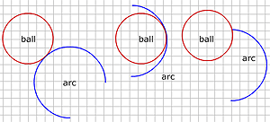
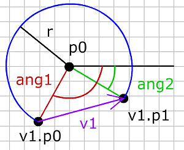
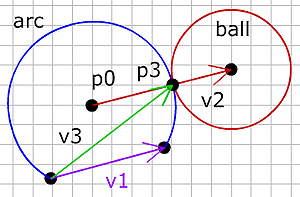

# 공 vs 호(Ball vs arc)

이제 움직이는 공을 호 형태와 다뤄야 한다면 어떤 상황이 벌어지는지 보도록 합시다. 호는 원의 부분이고, 원이 전체 360도인데, 호는 360도에 미치지 못합니다. 공 대 공의 충돌로 우리는 오직 1 개의 가능한 충돌 점이 있었습니다. 공 대 호에서는 하나만 있지 않고, 3개 더 가능한 충돌 점이 있습니다.

왼쪽편은 움직이는 공이 호의 바깥 측면에서 부딪히고, 가운데는 공이 안쪽 측면에서 부딪히고, 오른쪽은 공이 호의 끝 점을 때리고 있습니다. 호는 2개의 끝점이 있고 공은 둘다 부딪힐 수 있습니다.

원을 정의하기 위해서 우리는 그 중심점의 좌표와 반경이 필요합니다. 호를 정의하기 위해서는 중심점과 반경도 필요하지만 시작점의 각과 끝점의 각도 또한 필요합니다.

호를 정의한 예시

  
arc = {
  p0:{x:170, y:90}, 
  r:30, 
  ang1:135, 
  ang2:315
};


예시에서 호의 중심은 x=170, y=90 이고, 반경은 30, 시작점의 각은 135도 그리고 끝점의 각은 315 입니다. 
위 정보를 알고 있으면, 아래와 같이 시작점과 끝점의 좌표를 구할 수 있습니다:

  
ang1rad = ang1 * PI/180;
ang2rad = ang2 * PI/180;
v1.p0 = {
  x: p0.x + r * cos(ang1rad),
  y: p0.y + r * sin(ang1rad)
};
v1.p1 = {
  x: p0.x + r * cos(ang2rad),
  y: p0.y + r * sin(ang2rad)
};


벡터 v1은 호의 시작과 끝 점 사이에 있습니다.

 

-----

 

# 충돌 (Collisions)

우리는 먼저 단계 10 에서 다룬 움직이는 공 대 공의 충돌을 이용해 바깥 측면에서 공이 호를 부딪히는지 검사합니다. 또한 충돌이 일어나게 되면, 공이 호의 빈 부분이 아닌 부분에서 부딪히는지도 검사해야 합니다.

우리는 공과 호가 붙어있는 점 p3를 찾아야 합니다. 이미 충돌이 일어날 때 움직이는 공의 중심 좌표를 알고 있기 때문에 충돌하는 순간 호의 중심에서 원의 중심까지 벡터 v2 를 그릴 수 있습니다:

  
v2 = {p0:arc.p0, p1:p3};


점 p3는 이 벡터 상에 있고 호의 중심으로부터 호의 반경과 같은 떨어진 거리에 있습니다.(또한 공의 중심에서 공의 반경 거리만큼 떨어져 있습니다)

  
p3 = {
  x : arc.p0.x + v2.dx * arc.r,
  y : arc.p0.y + v2.dy * arc.r
};


다음으로 호의 시작점에서 점 p3까지 벡터를 그립니다.

  
v3 = {p0:v1.p0, p1:p3};


점 p3는 v3와 v1의 왼쪽 노말의 내적이 0 보다 클 때 호 선상에 있습니다.

  
if(dotP(v3, v1LeftNormal) >= 0){
  //collision
}else{
  //not on the arc
}


만약 충돌이 검출되고 공이 외부에서 호를 부딪히면 다른 3 개의 충돌 검사를 생략할 수 있습니다. 하지만 충돌 점이 호의 밖(비어있는 원둘레)에 있었다면 우리는 공이 안쪽에서 호를 때리는지 호의 끝점을 때리는지 여부를 점검할 필요가 있습니다.

호의 끝 점들에 대해서, 끝점의 좌표에 반경이 0 인 보이지 않는 공이 있다고 상상하고, 움직이는 공 대 공 시스템과 같은 것을 사용할 수 있습니다. 

여기서 사용한 공 대 호에 대한 경우 :

  
ballvsBall(ball, arc.p0, arc.r);


그리고 다음과 같이 호의 시작과 끝점 충돌을 생각할 수 있습니다. arc.edge는 호의 시작에서 끝점까지의 벡터입니다. 그림에서는 v1 입니다.

  
ballVsBall(ball, arc.edge.p0, 0);
ballVsBall(ball, arc.edge.p1, 0);


호 안에서 공의 충돌에 대해서는 약간 수정한 외부 충돌 시스템을 사용합니다. 

외부 충돌인 경우 :

  
float r = arc.r + ball.r;
float moveBack = Math.sqrt(r*r - vn.length*vn.length);
p3 = {
  x : vn.p0.x - moveBack * ball.dx,
  y : vn.p0.y - moveBack * ball.dy
};


내부 충돌인 경우 :

  
float r = arc.r - ball.r;
float moveForward = sqrt(r*r - vn.length * vn.length);
p3 = {
 x: vn.p0.x + moveForward * ball.dx;
 y: vn.p0.y + moveForward * ball.dy;
}


공이 점 보다 호에 더 충돌할 가능이 있기에 모든 3가지 충돌이 발견된 후에는 공이 충돌로 가는 가장 짧은 길을 선택할 필요가 있습니다.

다음 공과 호의 예제에서 즐겨봅시다.

<canvas data-processing-sources="../data/ball_vs_arc.pde"></canvas>
<small>(소스파일 [pde](../data/ball_vs_arc.pde)를 다운받을 수 있습니다.)</small>

 
 
끝.

여기까지 준비한 내용을 마무리합니다.
장담해드릴 순 없지만, 추후 더 추가될 수 있는 내용이 있으면 붙이도록 하겠습니다. 감사합니다.

