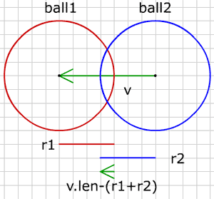
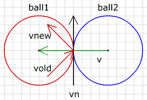

# 공 vs 공

우리는 지금까지 충분히 벽을 다루었고, 벽은 공을 잘 반동시키고 있으며 아담한 휴식을 받을 만합니다. 짝짝짝!

이제 2개의 공이 충돌하는 것에 대해 알아보겠습니다. 역시 가정을 해봅니다. 공 하나는 계속 움직이고 있으며 그래서 운동벡터를 갖고 있지만, 다른 공은 움직이지 않습니다. 아마도 그 공은 바닥에 버젓이 놓여있거나, 아마도 천장에 붙어 있거나 아직 운동을 배우지 못했을 것입니다.

먼저 공들이 충돌하는지 알 수 있는 방법을 알아봅시다. 그런 다음 충돌 이후 움직이는 공으로 무엇을 할지 생각해 보겠습니다.

그림에서 공1(빨강)은 공2(파랑)와 충돌합니다. 두 공의 중심점들 사이의 벡터는 v(녹색)입니다. 벡터 v의 길이가 두 공의 반경을 더한 것보다 작을 때만, 충돌이 일어납니다. 우리는 움직이는 공을 다른 공 바로 옆으로 놓아야 하고 다음의 양(pen)만큼 v의 방향으로 공1을 이동시키면서 그렇게 할 수 있습니다.

  
pen = v.length - (b1.r + b2.r)


이제 공들이 훌륭하고 완벽하게 서로의 옆에 놓여졌으니 운동 벡터를 어떻게 변경해야 할지 알아내야 합니다. 보이지 않는 벽이 두 공 사이에 있다고 상상해보십시요. 그러면 그 벽의 방향은 정확히 공들의 중심점 사이의 벡터 노멀과 같습니다.

그림에서 검은 벡터는 벡터 v의 노멀이며 공1의 운동벡터는 공이 벽에 반동하는 것처럼 계산되어 집니다.

여기, 여러 개의 고정된 공들이 있는 스테이지를 한 개 공이 돌아다니는 예제를 하나 만들었습니다.

<canvas data-processing-sources="../data/ball_vs_ball.pde"></canvas>
<small>(소스파일 [pde](../data/ball_vs_ball.pde)를 다운받을 수 있습니다.)</small>

다른 공들을 드래그해 보세요.

 

-----

 

# 안에 가두기 (Keep it in)

여러분은 아마 다른 (분명히 더 큰) 공 안에 움직이는 공을 가두기도 원할 것입니다.

<canvas data-processing-sources="../data/ball_vs_ball_keep_it_in.pde"></canvas>
<small>(소스파일 [pde](../data/ball_vs_ball_keep_it_in.pde)를 다운받을 수 있습니다.)</small>

이 경우 큰 공은 big 이고 작은 움직이는 공은 ball 입니다. 다음 조건에서 작은 공은 밖으로 움직입니다.

  
big.r < (ball.r + v.len)


그런 일이 벌어진다면 우리는 공을 다음의 양만큼 뒤로 물려놓아야 합니다.

  
float pen = big.r - (ball.r + v.length);


그리고, 반동에 사용되어질, 벡터 v의 노말의 방향을 반전시키는 것을 잊지 말아야 합니다 :


vbounce.dx = -v.dy;//v.ldx * -1
vbounce.dy = v.dx;//v.ldy * -1
vbounce.ldx = -v.dx;
vbounce.ldy = -v.dy;

	

 
 
다음 : [Ball vs Moving Ball]({{ "/ball_vs_moving_ball/" | prepend: site.baseurl }})

