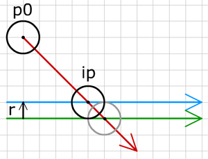
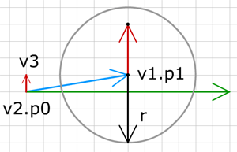

# 공 vs 선 (Ball vs line)

이제까지 여러분은 단 하나의 움직이는 점만 사용해서 아마 지루할 것입니다.  움직이는 점에 문제가 있는 것은 아니고, 점들은 완전하지만, 점은 점일 뿐입니다, 여러분 주변에 얼마나 많이 움직이는 점들을 볼 수 있나요? 많이 없을 것입니다. 결론적으로, 우리는 큰 걸음 앞으로 나아가 좀더 현실적인 - 공 같은 것을 움직이기 시작할 것입니다.

여러분은 실생활에서 많은 공들을 만났을 것은 확신합니다. 그래서 여러분은 점과 공이 어떻게 다른지 압니다. 공은 너비를 갖습니다. 우리의 2D 예제에서 공은 원으로 표현되고 그것의 중앙에 좌표를 갖고, 반경 또한 갖습니다.

  
game.myOb={r:10};
game.myOb.p0={x:150, y:100};


여기 움직이는 물체는 반경이 10인 공입니다. 이제 그 공의 중심 좌표, 운동 벡터, 반경을 알고, 어느 지점에서 벽에 충돌할 지 알기 원합니다.

그림에서 공의 중심점과 벽의 교차점은 회색 원이 있는 곳일 것입니다. 실제 공은 이전에 벽에 부딪힙니다. 벽에 부딪히는 실제 지점은 공의 운동벡터(빨강)와 공의 반경만큼 노말 방향으로 벽 벡터(초록)를 이동시킨 벡터(파랑) 의 교차점입니다. 그래서, 벽 벡터로 교차점을 찾는 대신에 방향은 같고 시작점이 옮겨진 다른 벽 벡터를 사용해야 할 것입니다.

 

----

 

# 축 방법 (Axes method)

선과 공의 교차점은 다른 방법으로도 구해질 수 있습니다. 좀더 간단한 투영을 이용해 어떻게 공이 벽에 부딪히는지 판단하는지 보도록 합시다.

그림에서 벡터의 끝점에 p1에 있는 공을 보세요. 벽의 시작점(v2.p0)에서 공의 중심점까지 벡터(파랑)을 그립니다. 이제 이 새로운 벡터를 벽의 노말에 투영하면, 그림에서 투영은 벡터 v3 (빨강) 입니다. 공을 벽 근처에 두기 위해서 다음 크기만큼 벽의 노말 방향으로 움직여야 합니다.

  
ball.r - v3.len


예제 코드에서 벽의 노말은 단위 벡터이여야 할 것입니다:

  
v.lx = v.dy;
v.ly = -v.dx;


runme 함수에서 모든 벽 벡터에 대한 검사를 수행합니다 :

  
for(var i=1; i<5; i++){
  var w = game["v"+i];
  //if we have hit the wall
  var pen = ob.r-findIntersection(ob, w);
  if(pen >= 0){
    //move object away from the wall
    ob.p1.x += w.lx*pen;
    ob.p1.y += w.ly*pen;
    //change movement
    var vb = bounce(ob, w);
    ob.vx = vb.vx;
    ob.vy = vb.vy;
  }
}


> 위 식에서 w.lx, w.ly 가 단위벡터의 속성 크기이기 때문에 pen 값을 곱했다.

각각 벽을 통과하는 양을 찾아내고, 만약 공이 벽 안에 있다면 공을 떨어뜨려 놓습니다. 그리고 같은 이전 bounce 함수를 사용해 새로운 운동 벡터를 구합니다.

통과한 길이를 구하는 함수 :

  
function findIntersection(v1, v2){
  //vector between center of ball
  //and starting point of wall
  var v3 = {};
  v3.vx = v1.p1.x-v2.p0.x;
  v3.vy = v1.p1.y-v2.p0.y;
  //project this vector on the normal of the wall
  var v = projectVector(v3, v2.lx, v2.ly);
  //find length of projection
  v.len = Math.sqrt(v.vx*v.vx+v.vy*v.vy);
  return v.len;
}


다음 예제에서 벽의 점들 중 끝 점을 드래그 해보십시요 :

    <object classid="clsid:d27cdb6e-ae6d-11cf-96b8-444553540000" width="300" height="200" id="vect7" align="middle">
        <param name="movie" value="vect7.swf" />
        <param name="quality" value="high" />
        <param name="bgcolor" value="#ffffff" />
        <param name="play" value="true" />
        <param name="loop" value="true" />
        <param name="wmode" value="opaque" />
        <param name="scale" value="noborder" />
        <param name="menu" value="false" />
        <param name="devicefont" value="false" />
        <param name="salign" value="" />
        <param name="allowScriptAccess" value="sameDomain" />
        <!--[if !IE]>-->
        <object type="application/x-shockwave-flash" data="vect7.swf" width="300" height="200">
            <param name="movie" value="vect7.swf" />
            <param name="quality" value="high" />
            <param name="bgcolor" value="#ffffff" />
            <param name="play" value="true" />
            <param name="loop" value="true" />
            <param name="wmode" value="opaque" />
            <param name="scale" value="noborder" />
            <param name="menu" value="false" />
            <param name="devicefont" value="false" />
            <param name="salign" value="" />
            <param name="allowScriptAccess" value="sameDomain" />
        <!--<![endif]-->
            
        <!--[if !IE]>-->
        </object>
        <!--<![endif]-->
    </object>

이 예제는 벽의 길이를 다루지 않음을 유념하세요, 모든 벽들은 끝없이 이어져 있는 것으로 간주합니다. 그렇기 때문에, 이 예제는 박스안에 공을 붙잡아 두는데 사용할 수 있지만, 박스 밖에 잡아두지는 못합니다. 다음 단계에서 벽의 코너에 공이 어떻게 충돌을 하는지 보도록 할 것입니다.

소스 <a href="vect7.fla">fla</a>를 다운받을 수 있습니다. 

 
 
다음 : [Ball in the corner]({{ "/ball_in_the_corner/" | prepend: site.baseurl }})

