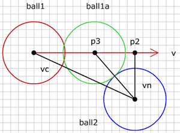

# 움직이는 공에 충돌하기 (Collision with moving ball)

지난 단계에서 2개 공의 충돌을 어떻게 확인하는지, 공의 반동 이후 움직임을 위한 새로운 방향을 찾는 법을 보았습니다. 
이것으로도 훌륭한 작업이지만, 문제가 좀 있습니다. 공이 매우 빠르게 움직일 수 없다는 것입니다. 그렇지 않으면 충돌검사가 실패합니다. 여기 그런 상황을 묘사한 것이 있습니다.

그림에서 공1(빨강)은 위치 p0에 있고 속도 v로 움직이고 있습니다. 다음 렌더링 사이클에 공은 위치 p1(초록)에 있을 것입니다. 
이전 사이클에서 공2에 대한 충돌을 검사하였고 다음 움직임 이후 다시 충돌을 검사합니다. 시작 위치와 마지막 위치에서 둘다 공1은 공2로부터 너무 멀리 떨어져 있기 때문에, 공2에 대한 충돌을 검출해낼 수 없습니다. 실제로 공2에 충돌이 일어날 것은 분명한데도 말입니다.

그림에서 공1은 공2의 충돌은 위치 p3에서 일어납니다. 우리는 위치 p3를 몇개의 벡터를 이용해 계산할 수 있습니다.

먼저 움직임 이전에 두 공의 중심 사이 벡터를 구합니다 :


vc.p0 = ball1.p0;
vc.p1 = ball2.p0;


이제 공 2와 운동 벡터에서 가장 가까운 점인 p2를 구합니다. 이 점은 벡터 vc 를 운동 벡터 v에 투영해서 쉽게 구할 수 있습니다. 점 p2에서 공 2의 중심으로 벡터를 그릴 수 있으며(vn), 이 벡터는 운동벡터 v의 노말과 같은 방향입니다.

  
//projection of vc on movement vector
Vector vp = projectVector(vc, ball1.dx, ball1.dy);
//vector to center of ball2 in direction of movement vector's normal
vn.p0 = new Point(ball1.p0.x+vp.vx, ball1.p0.y+vp.vy);
vn.p1 = ball2.p0;


우리는 이제 두 공의 크기를 더한 것에 대해 vn의 길이를 검사합니다. 만약 vn이 반경을 더한 것보다 길면 충돌이 없습니다. 
만약 vn의 길이가 그 것과 같으면 공1이 정확히 점 p2에 있을 때 충돌이 납니다. 
vn이 짧다면, 공1이 p2를 도달하기 전에 충돌이 일어납니다.

  
float sumRadius = ball1.r + ball2.r;
float diff = sumRadius - vn.length;
if(diff > 0){
  //collision
} else {
  //no collision
}


공 사이의 충돌을 한번 검출하면 공1을 점 p2에서 점 p3로 되돌려 놓아야 합니다. 그런데 p3는 어떻게 찾을까요? 위 그림에서 충돌하고 있는 공을 다시 살펴보면 여러분은 공2의 중심, p2, p3가 만드는 삼각형을 볼 수 있을 것입니다. 아마도 그 삼각형을 좋아할 정도는 아니지만, p3를 찾기 충분할 정도로 우리는 이미 이 삼각형에 대해 충분히 많이 알고 있습니다. 먼저, p2에서 공2의 중심까지 빗변 길이를 압니다. 이것은 벡터 vn이고 vn의 길이는 그 빗변의 길이입니다. 다음으로 우리는 또한 p3에서 공2의 중심까지 측면 길이를 압니다. 이것은 sumRadius와 같습니다. 이제 우리는 p2에서 p3까지 세번째 측면 길이를 구하기 위해 유용한 피타고라스 원리를 이용할 수 있습니다.

  
float moveBack = sqrt(sumRadius*sumRadius - vn.length*vn.length);
Point p3 = new Point();
p3.x = vn.p0.x - moveBack*ball1.dx;
p3.y = vn.p0.y - moveBack*ball1.dy;
v3.p0 = ball1.p0;
v3.p1 = p3;


그래서 moveBack 의 값만큼 p2에서 운동벡터 v의 반대방향으로 이동합니다. p3가 벡터 v의 밖에 있는 것은 이번 운동 사이클 동안 충돌이 일어나지 않을 것이며, 과거에 일어났거나 미래에 일어날 것임을 의미합니다. 우리는 지금 충돌에 대해서만 다룰 것이기에 벡터 v 위에 p3가 있는 것에 대해 검사해야 합니다.

  
if(v3.length < ball1.length && dotP(v3, ball1) > 0) {
  ball1a.p0 = p3;
} 


먼저, 공1의 중심에서 p3 까지 벡터의 길이는 벡터 v의 길이보다 짧아야 합니다. 또한 두 벡터는 같은 방향일 필요가 있고, 이것은 두 벡터의 내적을 계산함으로써 구할 수 있습니다.

이 방법은 운동이 시작될 때 공들이 충돌하지 않고 있다고 가정하는 데, 이러한 상황은 이 단계에 대한 충돌을 계산하기 전에 잘 처리해야 합니다.

다른 공과 충돌하는 운동벡터를 가진 공 예제를 하나 만들었습니다.

<canvas data-processing-sources="../data/ball_vs_moving_ball.pde"></canvas>
<small>(소스파일 [pde](../data/ball_vs_moving_ball.pde)를 다운받을 수 있습니다.)</small>

공 또는 벡터의 끝점을 드래그할 수 있습니다. 빨간 원은 공1의 시작점에 있고, 초록은 공1이 끝나는 곳이고, 파랑은 공2 입니다.

 
 
다음 : [Moving balls]({{ "/moving_balls/" | prepend: site.baseurl }})

