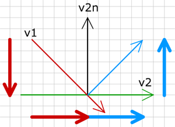
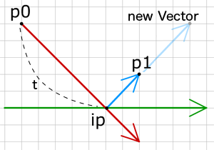

# 반동 (Bounce)

충돌이 일어나면, 대상으로부터 튕겨나는 것이 일반적입니다. 머리로 벽을 쳤다면, 그런 일은 분명하게 보이지 않을 수 있습니다. 그러나 공과 같은 물체를 보면, 공이 방해물을 뚫고 움직임을 계속하거나 바로 그 앞에 멈추는 일이 드문 일 입니다.

충돌이 일어난 후에 새로운 운동 벡터를 구하는 방법을 살펴봅시다.

그림에서 빨간 선은 운동벡터, 녹색은 벽(벡터), 검정은 벽의 노말이며, 파란색은 충돌 후 새로운 운동벡터입니다. 굵은 선들은 벽과 벽의 노말에 대한 운동 벡터의 투영들입니다.

원래의 움직임 벡터와 새로운 움직임 벡터가 어떻게 다른지 매우 분명합니다. 보이지 않나요? 자, 그들의 투영들을 보십시요. 벽에 대한 투영은 정확히 같은데, 벽의 노말에 대한 투영은 반대 방향을 갖습니다. 이로써 우리는 벽에 튕기면서 움직이는 객체를 위한 시스템을 쉽게 만들 수 있습니다.

+ 교차점을 찾는다
+ 운동 벡터의 투영을 구한다.
+ 노말에 대한 투영의 방향을 반전시킨다.
+ 투영들을 더한다.

투영이 무엇이고 어떻게 구하는지 잊어버렸다면, chapter 3 를 살펴보십시요.
v1 은 운동 벡터입니다. v2 는 벽(방해물) 벡터입니다. v2의 왼쪽 노말은 :

  
v2.lx = v2.vy;
v2.ly = -v2.vx;


v1 과 v2 의 내적은 :

  
dp1 = v1.vx*v2.vx + v1.vy*v2.vy;


v2 에 대한 운동 벡터의 투영은 :

  
proj1.vx = dp1*v2.dx;
proj1.vy = dp1*v2.dy;


v1 과 v2 노말 사이의 내적은 :

  
dp2 = v1.vx*v2.lx + v1.vy*v2.ly;


v2 노말에 대한 운동 벡터의 투영은(단위벡터를 이용하기 위해 왼쪽 노말을 길이로 나눈 점을 유념하세요) :

  
proj2.vx = dp*(v2.lx/v2.len);
proj2.vy = dp*(v2.ly/v2.len);


노말에 대한 투영을 반전시킵니다 :

  
proj2.vx *= -1;
proj2.vy *= -1;


투영들을 더해서 새로운 운동벡터 구하기 :

  
v1.vx = proj1.vx+proj2.vx;
v1.vy = proj1.vy+proj2.vy;


이 예제에서 점들을 움직여 보고, 운동벡터가 어떻게 변하는지 봅시다 :

<canvas data-processing-sources="../data/bounce.pde"></canvas>
<small>(소스파일 [pde](../data/bounce.pde)를 다운받을 수 있습니다.)</small>

 

----

 

# 실제 반동과 마찰 (Real bounce and friction)

실생활에서도 마찰과 에너지 감소 때문에 오브젝트가 끝없이 움직일 수 없으며, 같은 방식으로 반동 또한 실제 완전하지 않습니다. 완전한 반동은 충돌 후 운동 벡터의 길이가 충돌 이전의 것과 정확히 같을 때 일어납니다. 반동력, 마찰력 이란 두 개 변수를 각 객체에 적용함으로써 반동에서 에너지 감소를 계산해 낼 수 있습니다.

  
ob.b = 0.99;
ob.f = 0.99;


새로운 운동 벡터를 구할 때 이제 우리는 두 물체의 b 와 f 를 각 투영에 곱할 것입니다. 반동력은 벽의 노말에 대한 투영에 영향을 주며, 마찰력은 벽 벡터의 투영에 영향을 줍니다.

  
v1.vx = v1.f*v2.f*proj1.vx + v1.b*v2.b*proj2.vx;
v1.vy = v1.f*v2.f*proj1.vy + v1.b*v2.b*proj2.vy;


물체의 b 와 f 가 1 이라면 어떨까? 그러면 완전한 반동이 일어납니다 - 충돌에서 아무것도 잃지 않고 운동은 같은 세기로 계속 유지됩니다. 예로 움직이는 물체나 벽이 반동력이 없다면(b=0) 충돌 후 운동 벡터는 벽과 평행하고 물체는 벽에 붙게 됩니다. 늪 또는 풀로 날아가는 공을 상상해 보십시요.

물론 1 보다 큰 반동도 갖을 수 있는데, 이런 경우 충돌은 운동의 속도를 높이게 될 것입니다. 이에 대한 좋은 예시로 핀볼의 범퍼를 들 수 있습니다. 볼이 범퍼와 부딪히면 볼의 속도를 증가 시킵니다.

다음 예제에는 중력과 많은 벽이 존재하는 스테이지 위에 움직이는 점이 있습니다. 벽의 끝점을 움직여 볼 수 있습니다.

<canvas data-processing-sources="../data/real_bounce.pde"></canvas>
<small>(소스파일 [pde](../data/real_bounce.pde)를 다운받을 수 있습니다.)</small>

움직이는 점은 모든 벽을 통과하여 계속 반복되며, 마지막 체크 이후 지난 시간동안 다른 것들과 부딪히는지 검사합니다. 점이 여러 벽에 충돌 할 경우, 그러면 가장 가까운 교차점있는 벽이 선택됩니다. 

그런 다음, 점의 끝점을 교차점으로 놓고 새로운 운동 벡터를 계산합니다. 그리고 (시작점에서 교차점까지의 시간값을 뺀) 교차점과 끝점까지의 시간만큼 교차점으로부터 새로운 벡터의 방향으로 이동합니다.

>아래 그림으로 다시 설명하면, 새로운 위치 p1은 반동하는 벡터의 (1-t) 시간만큼 진행된 위치이다.

  
p1 = {x: ip.x + (newV.vx * (1-t)), y: ip.y + (newV.y * (1-t))}


예제 코드를 아래와 같이, 적어도 두 가지 방법으로 시스템을 더 향상시킬 수 있습니다 :

1. 물체가 지난 렌더링 타임에 스크린 상 시작점 p0 위치에 그려지고, 다음 타임에 끝점 p1에 그려지기 때문에 물체가 벽 근처 교차점 ip에 거의 접근할 수 없음을 유추할 수 습니다. 아마도 p0에서 p1으로 바로 이동하는 물체를 보게 될 것입니다. 이런 상황이 틀렸음에도, 때때로 물체가 교차지점 근처에 놓이게 한다면 눈에서는 물체가 벽을 치는 것을 볼 수 있을 것입니다.

2. 물체가 처음 벽 이후 다른 벽에 이어서 부딪힐 가능성이 있습니다. 예제는 가장 가까운 벽에서만 반동합니다. 정확히 하려면, 새로운 벡터가 구해진 후 모든 벽과 충돌 확인을 시작해야 할 것입니다. 이때 교차점에서 p1 으로 생긴 새로운 벡터(그림에서 파랑)에 대해서만 확인해야 합니다.

 
 
다음 : [Ball vs line]({{ "/ball_vs_line/" | prepend: site.baseurl }})

