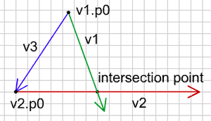
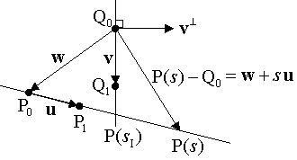
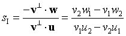
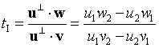

# 교차하기 (Intersection)

이제 오브젝트를 움직이는 법을 알게 되었습니다. 그런데 움직이는 모든 오브젝트들은 언젠가 무언가와 충돌할 것입니다. 이동하는 물체가 예를 들어 당신이라면, 운이 좋게도 침대처럼 부드러운 것에 부딪힐 수도 있고 때론 딱딱한 소재 -돌벽, 시멘트 바닥, 닫힌 문에 충돌할 수도 있습니다. 현실에는 당신과 부딪히기만을 기다리거나 움직이는 딱딱한 물체들이 많이 존재합니다. 그래서 미래에 어떤 물체가 나와 충돌할지 미리 아는 것은 현명하고 머리 건강에도 좋습니다.

여기 객체의 운동 벡터와 벽을 만들고 있는 벡터가 있습니다. 우리는 객체가 벽에 부딪히는지, 그렇다면, 언제, 어디서 일어나는지 알고자 합니다. 이렇게 다시 질문합니다. "어디에서 두 벡터가 교차할까요?"

먼저 그들이 교차하지 않는 경우를 봅시다. 벡터들이 평행하면 교차할 수 없습니다. 그리고 벡터의 단위벡터들이 같다면 그들은 평행합니다(같은 방향일 필요는 없으며, 반대 방향이여도 됩니다).

  
(v1.dx == v2.dx and v1.dy == v2.dy)
(v1.dx == -v2.dx and v1.dy == -v2.dy)


벡터들이 평행하지 않으면 언젠가는 교차합니다. 초록선은 시작점 p0를 갖고 있는 운동 벡터이고, 빨간선은 시작점 p0 를 갖고 있는 벽입니다. 파란색은 시작점 간의 벡터입니다.



교차점(intersection point)은 이렇게 계산하여 구할 수 있습니다:

  
v3 = {vx: v2.p0.x - v1.p0.x, vy: v2.p0.y - v1.p0.y};
float t = perP(v3, v2) / perP(v1, v2);
ip={};
ip.x = v1.p0.x + v1.vx*t;
ip.y = v1.p0.y + v1.vy*t;

//calculate perp product of 2 vectors
float perP(Vector v0, Vector v1) {
  return v0.vx*v1.vy - v0.vy*v1.vx;
}


먼저 시작점 사이의 벡터 v3를 구합니다. 여기서 사용된 함수는 두 벡터의 Perp product을 구합니다. [Perp product](http://geomalgorithms.com/vector_products.html)는 첫번째 벡터 대신에 그 오른쪽 노말([perp vector](http://geomalgorithms.com/vector_products.html))을 사용한다는 점만 빼고 내적과 비슷합니다. 오른쪽 노멀은 90도 회전한 벡터를 말합니다. 내적은 다음과 같습니다:

  
dp = v1.vx*v2.vx + v1.vy*v2.vy;



그리고 오른쪽 노말은 이렇습니다.

  
v.rx = -v.vy;
v.ry = v.vx;


그래서 v1을 노말로 변경하면 다음 식을 얻게 됩니다.

  
pp = -v1.vy*v2.vx + v1.vx*v2.vy;


이는 위 함수가 찾는 값입니다.

두 perp product 의 비율 t는 운동벡터 v1의 끝점에서 정확히 교차하면 정확히 1이 됩니다. 만약 t가 0에서 1사이 값이라면 교차점은 v1 선상에 있습니다. 그런데, t가 음수이면 벡터는 과거에 교차했을 것이고, 1보다 큰 수이면, 교차는 미래에 언젠가 일어날 것입니다.

교차점이 어떤 벡터 위에 있는지 알고 싶다면 물론, v2의 t값 또한 알아내야 합니다:

  
v3 = {vx:v1.p0.x-v2.p0.x, vy:v1.p0.y-v2.p0.y};
float t = perP(v3, v1)/perP(v2, v1);


이 예제에서 점들을 움직여 보고 어디서 교차하는지 보세요:

<canvas data-processing-sources="../data/intersection.pde"></canvas>
<small>(소스파일 [pde](../data/intersection.pde)를 다운받을 수 있습니다.)</small>

>교차 알고리즘이 어떻게 만들어지는지 실제 방법에 관심있다면, [여기](http://geomalgorithms.com/a05-_intersect-1.html)를 참고할 만하다.

<br>
<br>

벡터 교차에 대한 좀더 자세한 설명을 붙여봅니다.

### Perp product 공식의 이해 #####

먼저 두 점(P<sub>0</sub>, P<sub>1</sub>)를 지나는 벡터 방정식을 매개변수로 표현한 방정식으로 표현하면, P(s) = P<sub>0</sub> + s(P<sub>1</sub> - P<sub>0</sub>) = P<sub>0</sub> + su(s는 실수, u는 벡터)로 정의할 수 있습니다. 이 표현을 빌리면, P(0) = P<sub>0</sub>, P(1) = P<sub>1</sub>, 0 <= s <= 1 입니다. 아래와 같이 s값을 정리합니다.

    su = P(s) - P0
    s = (P(s) - P0) / u
    s = (P(s) - P0) / (P1 - P0)
    s = d(P0, P(s)) / d(P0, P1)

벡터 d로 정리된 s값을 살펴보면, s가 0보다 작으면 P(s)는 P0의 바깥 쪽에 있고, s가 1 보다 크면 P(s)는 P<sub>1</sub>의 바깥 쪽에 있음을 알 수 있습니다.

평행한 두 벡터 u(P<sub>1</sub> - P<sub>0</sub>), v(Q<sub>1</sub> - Q<sub>0</sub>)에 대해 u = Cv 가 성립됩니다(C는 실수).
같은 의미로 u/v 값은 항상 같은 값을 유지하는데 u(1)/v(1) = u(k)/v(k) 으로 표현할 수 있습니다. <br>

```
u(1)v(k) - u(k)v(1) = 0
```

이때 u=(u1, u2) 이고 v=(v1, v2)에 대해 u1v2 - u2v1 = 0 임을 Perp product라고 합니다. 기호로 u⊥·v = 0, (u가 (u1, u2) 일 때, u⊥ = (-u2, u1) 입니다. ⊥ 는 perp operator, 직교 연산자)

**두 벡터가 평행하기 때문에 벡터 u의 직교벡터와 벡터 v 의 내적은 0 인 것입니다.**

교차점을 구하기 위해서는 2개의 벡터와 함께 연관된 벡터를 같이 고려해야 합니다.



그림에서 v 와 u 의 교차점 P(si)를 구하고자 합니다. 벡터 w 는 w = P<sub>0</sub> - Q<sub>0</sub> 일 때, P(s) - Q<sub>0</sub> = w + su 입니다. 그리고 교차점을 지나는 벡터 P(si) - Q<sub>0</sub> 는 v⊥와 직교합니다. perp product 공식을 적용합니다.

    v⊥·(w+si u) = 0
    v⊥·w + v⊥·si u = 0




그리고 두 벡터가 평행하면 v⊥· u = 0 임을 알고 있으니, 직교 연산자의 속성인 u⊥·v = -v⊥·u 을 이용해 Q(ti) 의 위치도 구합니다.



교차점 I = P(si) = P(ti) 이기 때문에 한가지만 알아도 충분합니다.

둘 중 하나 벡터의 길이가 무한하지 않은 경우, 교차점은 벡터의 (0<= si <= 1) 구간에서 일어납니다. 두 벡터의 길이가 무한하지 않은 경우, P, Q 모두에 대해서 0<= si <= 1 구간에 있어야 교차하게 됩니다. si가 1이면 벡터의 끝에서 만나게 되며, 0보다 작으면 이전에 만났을 경우가 됩니다. 1보다 크면 앞으로 만날 가능성이 있습니다.

<br>
<br>
다음 : [Bounce]({{ "/bounce/" | prepend: site.baseurl }})


