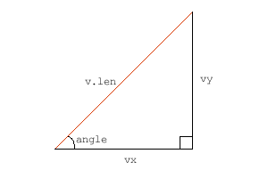
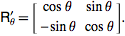

# 벡터의 속성을 더 알아볼까요?

2개의 포인트와 vx/vy 요소는 벡터를 이루는 기본적인 요소가 되지만, 벡터에는 더 유용한 속성들이 있습니다. 예를 들어, 벡터는 길이라는 속성이 있습니다. 벡터의 길이는 정확히 시작점과 끝점 사이의 거리입니다. 우리는 이미 벡터의 vx/vy 요소를 알고 있기 때문에, 매우 쉽게 그 길이를 계산할 수 있습니다.


v.length = Math.sqrt(v.vx * v.vx + v.vy * v.vy);


이 방법은 훌륭하신 옛그리스 수학자 피타고라스의 피타고라스 원리입니다. 
x 성분의 제곱값과 y 성분의 제곱값을 더한 다음, 그 값의 제곱근을 구합니다.

벡터를 사용하면 각도, 사인 그리고 다른 어려운 수학적인 것들을 어느 정도 피할 수 있기 때문에 매우 좋습니다. 
때때로 각도를 사용할 일이 많은데, 그런 상황을 위해 우리는 어떤 벡터도 각도 또는 길이 형식으로 변환할 줄 알아야 합니다. 
다행스럽게도 변환은 어렵지 않습니다.

  
angle = Math.atan2(v.vy, v.vx); 


>여기서 나온 값은 [라디안(radian)](https://ko.wikipedia.org/wiki/%EB%9D%BC%EB%94%94%EC%95%88) 단위이다. atan2 함수는 삼각함수 tan의 역계산으로 밑변과 높이를 통해 밑변과 경사면의 각도를 얻을 수 있다.

보통 물리적 움직임을 계산하는 데 각도를 라디안으로 처리하기가 편리합니다. 
그런데 필요에 따라 라디안을 360도계 각으로 바꿀 필요가 있습니다.
360도는 2파이(π, [원주율](https://ko.wikipedia.org/wiki/%EC%9B%90%EC%A3%BC%EC%9C%A8))이므로 아래처럼 구할 수 있습니다.


angleDegree = angle * 180 / Math.PI;


> 라디안은 주로 삼각함수 계산에서 많이 사용하기 때문에 물리계산에서는 절대적으로 필요하다. 참고로 플래시에서 심볼의 rotation 값은 360계 각이다.

그리고 각도와 길이를 알고 있을 때 이들 정보만으로 벡터를 만들어야 할 때도 있을 것입니다. 
그 방법을 모른다면 걱정할 필요 없습니다. 
많이 복잡하지 않습니다.

  
v.vx = v.length * Math.cos(angle);
v.vy = v.length * Math.sin(angle);


> 이 방법은 직각삼각형에서 빗변과 사이각을 통해 가로와 높이를 구하는 방법이다. 아래 직각삼각형에서 빨간선을 벡터라고 볼 때, vx 길이는 cos을 이용하고 vy 길이는 sin을 이용해서 구한다.



<br>

-----

<br>

# 어떤 벡터가 표준일까요?

놀랍겠지만 모든 벡터가 표준은 아닙니다. 다시 말해, 일부는 평균적이고 일부는 독특하듯이 사람들과 많이 닮았습니다. 
사람들과 다른 것은 벡터는 평균화를 시킬 수 있습니다. 평균화를 시키면, 같은 방향이면서 길이는 1인 [단위 벡터](https://en.wikipedia.org/wiki/Unit_vector)를 구할 수 있습니다.

  
v.dx = v.vx / v.length;
v.dy = v.vy / v.length; 


모든 벡터들은 vx, vy 속성을 길이로 나누면 일정 길이를 가진 단위 벡터를 구할 수 있으며, 2개 속성 dx,dy 를 갖습니다. 
단위 벡터는 길이가 1 인데, 실제로 우리의 친구 피타고라스의 원리를 이용해 dx, dy 로부터 길이를 구할 수 있습니다. 

단위 벡터는 방향 정보만 갖고 있고 길이에 대한 정보는 없습니다. 
"기차역은 이쪽 방향이에요" 라고 말하는 것과 같이 방향은 알 수 있지만 거리는 모르는 것과 같습니다.

단위 벡터를 만들 때에는 0 으로 나누지 않도록 조심해야 합니다. 그러면 길이가 0인 벡터가 되는데, 그 방향을 알 수 없는 단위화가 이루어지는 셈입니다. 
프로그램에 따라서 0으로 나눈 값에 대해 "Infinity" 또는 이상한 값을 내놓습니다.

>당연한 말이지만 단위벡터(unitA)에 크기를 곱하면 원래 벡터가 나온다.
>
>```A = |A| unitA```

<br>
벡터는 [노멀(normals)](https://en.wikipedia.org/wiki/Normal_(geometry)) 이란 속성도 갖고 있는데, 노멀들은 벡터에 정확히 직교합니다. 360도계 표현이 빌리자면, 노멀들은 90도 회전되어 있는 것입니다. 벡터는 방향을 갖고 있기 때문에 오른쪽 방향과 왼쪽 방향의 2개 노멀을 갖고 있습니다. 잠깐 일어서서 벡터의 방향 쪽으로 얼굴을 바라보세요. 
그리고 양 팔을 들어올리면, 여러분의 손은 각각 오른쪽, 왼쪽 노멀이 되는 셈입니다.

예제 코드에서 오른쪽 방향과 왼쪽 방향 노멀을 이렇게 구하고 있습니다.

  
v.rx = -v.vy;
v.ry = v.vx; 
v.lx = v.vy;
v.ly = -v.vx;  


>노멀은 벡터의 좌우로 90도 회전한 것이다. 그래서 -90, 90도 회전한 좌표를 구하기 위해 아래 Arfken의 [회전행렬](http://mathworld.wolfram.com/RotationMatrix.html)을 이용할 수 있다. Arfken의 회전행렬은 고정된 외부좌표계를 기준으로 오브젝트의 회전을 구하는 방법이 아니라, 오브젝트를 기준으로 만들어지는 좌표계를 회전시키는 방법으로 벡터를 기준으로한 좌우 노멀을 구할 수 있다.
>
>
>
>오른쪽 노말에 대한 계산을 해보자. 코사인 90 은 값이 0 이고, 사인 90 은 1 이다. 그래서 90도 회전에 대한 행렬계산은 이렇게 정리된다.(x", y" 은 x, y 의 회전 결과값)

    x" = -y; 
    y" = x;

>
>일반적으로 각도가 반시계방향으로 증가하는 데, 반드시 반시계방향으로 증가하지 않는 환경도 존재한다. 그래서 자신이 작업하고 있는 좌표계가 어떻게 되어있는지 꼭 확인할 필요가 있다. 참고로 플래시에서 Matrix 의 rotation 함수는 위와 같은 행렬계산을 실행한다.
>
>사실 노멀은 이런 행렬계산까지 하지 않아도 우리가 알고 있는 평면좌표에 그려보면 공식을 알 수 있다.

마지막으로, 간단한 예제를 만들었습니다. 포인트를 움직여보면 벡터가 어떻게 변화되는지 볼 수 있습니다.

<canvas data-processing-sources="../data/length_normals.pde"></canvas>
<small>(소스파일 [pde](../data/length_normals.pde)를 다운받을 수 있습니다.)</small>

검은 색 선은 벡터이고, 파란색은 단위벡터, 녹색은 오른쪽 노멀, 빨간색은 왼쪽 노멀입니다.

<br>
<br>
다음 : [Adding, Projecting]({{ "/adding_projecting/" | prepend: site.baseurl }})


