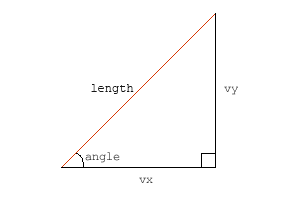

# Basic. 벡터는 무엇을 갖고 있을까요?

2개의 포인트와 x/y 구성 요소가 있어서 모든 벡터를 다루기에 충분히 만족스럽지만, 벡터는 더 유용한 속성들을 가지고 있습니다. 예를 들어, 벡터는 길이라는 속성이 있습니다. 벡터의 길이는 정확히 시작점과 끝점 사이의 거리입니다. 우리는 이미 벡터의 x/y 구성 요소를 알고 있기 때문에, 매우 쉽게 그 길이를 계산할 수 있습니다 :


v.len = Math.sqrt(v.vx*v.vx+v.vy*v.vy);


이 방법은 훌륭하신 옛날 그리스 수학자 피타고라스의 피타고라스 원리입니다. x 성분의 제곱값과 y 성분의 제곱값을 더한 다음 그 값의 제곱근을 구합니다.

벡터를 사용하면 각도, sinuses 그리고 다른 어려운 수학적 것들을 다룰 필요가 없기 때문에 매우 좋습니다. 그런데 저는 많은 사람들이 여전히 각도를 좋아한다고 알고 있으며, 그 사람들은, 이상하겠지만, 사람들이기 때문에 우리는 어떤 벡터도 각도/길이 형식으로 변환할 줄 알아야 합니다. 다행스럽게도 변환은 어렵지 않습니다. (옙, 모든게 쉽습니다):

  
angle = Math.atan2(v.vy, v.vx); 


>여기서 나온 값은 라디안(radian) 단위이다.

여러분은 플래시가 모든 각도를 라디안으로 처리하기를 얼마나 좋아하는지 아마 알 것입니다. 그래서 무비클립을 벡터의 움직임 방향으로 놓고자 한다면, 라디안 각을 각도로 바꿀 필요가 있습니다 :

>플래시에서 심볼의 rotation 값은 각도이다. 라디안은 주로 삼각함수 계산에서 사용하기 때문에 물리계산에서는 절대적으로 필요하다.


angledeg = angle*180/Math.PI;


때때로 각도와 길이를 알고 있을 때 이들 정보만으로 벡터를 만들어야 할 때도 있을 것입니다. 그 방법을 모른다면 걱정할 필요 없습니다. 많이 복잡하지 않습니다.(이번엔 쉽다라는 말은 사용하지 않았어요) :

  
v.vx = v.len*Math.cos(angle);
v.vy = v.len*Math.sin(angle);


>모두 알다시피 이 방법은 직각삼각형에서 빗변과 사이각을 통해 가로와 높이를 구하는 방법이다. 아래 직각삼각형에서 빨간선을 벡터라고 볼 때, vx 길이는 코사인을 이용하고 vy 는 사인을 이용해서 구한다.

-----
 
# 어떤 벡터가 표준일까요?

놀랍겠지만 모든 벡터가 표준은 아닙니다. 다시 말해, 일부는 평균적이고 일부는 독특하듯이 사람들과 많이 닮았습니다. 사람들과 다른 것은 벡터는 평균화를 시킬 수 있습니다. 평균화를 시키면, 같은 방향이면서 길이는 1인 단일 벡터를 구할 수 있습니다.

  
v.dx = v.vx / v.len;
v.dy = v.vy / v.len; 


모든 벡터들은 x, y 속성을 길이로 나누면 일정 길이를 가진 단위 벡터를 구할 수 있으며, 2개 속성 dx,dy 를 갖습니다. 단위 벡터는 길이가 1 인데, 실제 재어보고 싶을 것입니다. 실제로 우리의 친구 피타고라스의 원리를 이용해 dx, dy 로부터 길이를 구할 수 있습니다. 테스트가 어렵다면 제 말을 그대로 믿어도 됩니다. 그러면 됩니다. 단위 벡터는 방향 정보만 갖고 있고 길이에 대한 정보는 없습니다. "기차역은 이쪽 방향이에요" 라고 말하는 것과 같이 방향은 알 수 있지만 거리는 모르는 것과 같습니다.

단위 벡터를 만들 때에는 0 으로 나누지 않도록 조심해야 합니다. 그러면 길이가 0인 벡터가 되는데, 그 길이를 알 수 없는 단위화가 이루어지는 셈입니다. 플래시는 0으로 나눈 값에 대해 "Infinity" 라는 값을 내놓습니다.

>당연한 말이지만 단위벡터에 크기를 곱하면 원래 벡터가 나온다.
>A = |A| unitA

벡터는 "노멀(normals)" 이란 속성도 갖고 있는데, 노멀들은 벡터에 정확히 직교합니다. 혹은 각도 표현이 좀더 익숙하다면, 노멀들은 90도 회전되어 있는 것입니다. 벡터는 방향을 갖고 있기 때문에 오른쪽 방향과 왼쪽 방향의 2개 노멀을 갖고 있습니다. 잠깐 일어서서 벡터의 방향 쪽으로 얼굴을 바라보세요.(물론 지금 앉아서 이글을 읽고 있고 앉아있는게 편하실테지만, 살짝 일어서 보는 것도 좋습니다.) 그리고 양 팔을 들어올리면, 여러분의 손은 각각 오른쪽, 왼쪽 노멀이 되는 셈입니다.

오른쪽 방향과 왼쪽 방향 노멀은 이렇게 구할 수 있습니다 :

  
v.rx = -v.vy;
v.ry = v.vx; 
v.lx = v.vy;
v.ly = -v.vx;  


>노멀은 벡터 좌우로 90도 회전한 것이다. 그래서 -90, 90 도 회전한 좌표를 구하기 위해 아래 회전행렬을 이용할 수 있다.
>

>오른쪽 노말에 대한 계산을 해보자. 코사인 90 은 값이 0 이고, 사인 90 은 1 이다. 그래서 90도 회전에 대한 행렬계산은 이렇게 정리된다.(x", y" 은 x, y 의 회전 결과값)
>x" = y;
>y" = - x;
>사실 노멀은 이런 행렬계산까지 하지 않아도 우리가 알고 있는 평면좌표에 그려보면 이런 식을 알 수 있다. 그런데 행렬계산으로 나온 식은 안내서에 나오는 식과 좌우 노멀이 서로 바뀌어 있다. 이것은 플래시가 y 값이 반전된 좌표를 사용하고 있기 때문이다. 일반적인 평면좌표와 행렬계산에서는 각도가 시계방향으로 증가하는 반면, 플래시(또는 2D CG)에서는 반시계방향으로 증가한다. Matrix 의 rotation 함수는 위와 같은 행렬계산을 실행한다. 매트릭스를 심볼에 적용하게 되면 각도가 증가할 수록 심볼이 반시계 방향으로 돌 것 같지만, 시계방향으로 돌도록 내부적으로 바로 잡아준다.

마지막으로, 간단한 무비클립을 만들었습니다. 포인트를 움직여보면 벡터가 어떻게 변화되는지 볼 수 있습니다.

    <object classid="clsid:d27cdb6e-ae6d-11cf-96b8-444553540000" width="300" height="200" id="vect2">
        <param name="movie" value="vect2.swf" />
        <param name="quality" value="high" />
        <param name="bgcolor" value="#ffffff" />
        <param name="play" value="true" />
        <param name="loop" value="true" />
        <param name="wmode" value="opaque" />
        <param name="scale" value="noborder" />
        <param name="menu" value="false" />
        <param name="devicefont" value="false" />
        <param name="salign" value="" />
        <param name="allowScriptAccess" value="sameDomain" />
        <!--[if !IE]>-->
        <object type="application/x-shockwave-flash" data="vect2.swf" width="300" height="200">
            <param name="movie" value="vect2.swf" />
            <param name="quality" value="high" />
            <param name="bgcolor" value="#ffffff" />
            <param name="play" value="true" />
            <param name="loop" value="true" />
            <param name="wmode" value="opaque" />
            <param name="scale" value="noborder" />
            <param name="menu" value="false" />
            <param name="devicefont" value="false" />
            <param name="salign" value="" />
            <param name="allowScriptAccess" value="sameDomain" />
        <!--<![endif]-->
            
        <!--[if !IE]>-->
        </object>
        <!--<![endif]-->
    </object>

검은 색 선은 벡터이고, 파란색은 단위벡터, 녹색은 오른쪽 노멀, 빨간색은 왼쪽 노멀입니다. 소스 fla 파일 역시 다운로드할 수 있습니다.

 
 
다음 : [Adding, Projecting]({{ "/adding_projecting/" | prepend: site.baseurl }})

