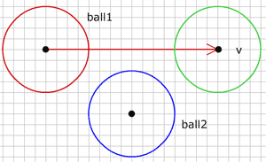
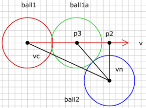

# 움직이는 공에 충돌하기 (Collision with moving ball)

지난 단계에서 2개의 공 사이 충돌을 어떻게 확인하는지, 공의 반동 이후 움직임을 위한 새로운 각을 찾는 법을 보았습니다. 이는 쉽고 멋진 것이지만, 문제가 있습니다 : 공이 매우 빠르게 움직일 수 없습니다. 그렇지 않으면 충돌검사가 실패합니다. 여기 그런 상황을 묘사한 것이 있습니다 :

그림에서 공 1 (빨강) 은 위치 p0 에 있고 속도 v 로 움직이고 있습니다. 운동 사이클 마지막에 공이 위치 p1 (초록) 에 있을 것입니다. 이전 사이클에서 공 2 에 대한 충돌을 검사하였고 이제 움직임 이후 다시 충돌을 검사합니다. 시작 위치와 마지막 위치에서 둘다 공 1은 공 2 로부터 너무 멀리 떨어져 있기 때문에, 공 2에 대한 충돌을 검출해낼 수 없습니다. 그런데 실제로 공 2에 충돌은 일어날 것은 분명합니다.

그림에서 공 1 은 공 2와 충돌하는데 충돌은 위치 p3 에서 일어납니다. 우리는 위치 p3 를 몇개의 벡터를 이용해 계산할 수 있습니다.

먼저 움직임 이전에 두 공의 중심 사이 벡터를 구합니다 :

  
vc={};
vc.p0=ball1.p0;
vc.p1=ball2.p0;


이제 공 2 과 운동 벡터에서 가장 가까운 점인 p2 를 구합니다. 이 점은 벡터 vc 를 운동 벡터 v 에 투영해서 쉽게 구할 수 있습니다. 점 p2 에서 공 2의 중심으로 벡터를 그릴 수 있으며(vn), 이 벡터는 운동벡터 v 의 노말과 같은 방향입니다.

  
vp = projectVector(vc, v.dx, v.dy);
p2 = {x:v.p0.x+vp.vx, y:v.p0.y+vp.vy};
vn = {};
vn.p0 = p2;
vn.p1 = ball2.p0;


우리는 이제 두 공의 크기를 더한 것에 대해 vn 의 길이를 검사합니다. 만약 vn 이 반경을 더한 것 보다 길면 충돌이 없습니다. 만약 vn 의 길이가 그 것과 같으면 공 1이 정확히 점 p2 에 있을 때 충돌이 납니다. vn 이 짧다면, 공 1 이 p2 를 도달하기 전에 충돌이 일어납니다.

  
totalRadius = ball1.r + ball2.r;
var diff = totalRadius-vn.len;
if(diff > 0){
  //collision
} else {
  //no collision
}


공 사이의 충돌을 한번 검출하면 공 1을 점 p2 에서 점 p3로 되돌려 놓아야 합니다. 그런데 p3는 어떻게 찾을까요? 위 그림에서 충돌하고 있는 공을 다시 살펴보면 여러분은 공 2 의 중심, p2, p3 가 만드는 삼각형을 볼 수 있을 것입니다. 아마도 그 삼각형을 좋아할 정도는 아니지만, p3 를 찾기 충분할 정도로 우리는 이미 이 삼각형에 대해 충분히 많이 알고 있습니다. 먼저, p2에서 공 2의 중심까지 빗변 길이를 압니다, 이것은 벡터 vn 이고 vn 의 길이는 그 빗변의 길이입니다. 다음으로 우리는 또한 p3 에서 공 2의 중심까지 측면 길이를 압니다. 이것은 totalRadius 와 같습니다. 이제 우리는 p2 에서 p3 까지 세번째 측면 길이를 구하기 위해 유용한 오랜 피타고라스 원리를 이용할 수 있습니다.

  
moveBack = Math.sqrt(totalRadius * totalRadius - vn.len * vn.len);
p3 = {x: p2.x - moveBack * v.dx, y: p2.y - moveBack * v.dy};
v3 = {p0: v.p0, p1: p3};


그래서 moveBack 의 값만큼 p2에서 운동벡터 v의 반대방향으로 이동합니다. p3 가 벡터 v의 밖에 있는 것은 이번 운동 사이클 동안 충돌이 일어나지 않을 것이며, 과거에 일어났거나 미래에 일어날 것임을 의미합니다. 우리는 지금 충돌에 대해서만 다룰 것이기에 벡터 v 위에 p3 가 있는 것에 대해 검사해야 합니다 :

  
if(game.v3.len < ob.len && dotP(game.v3, ob) > 0){
  //collision
  game.ob1.p0 = game.p3;
}


먼저, 공 1 의 중심에서 p3 까지 벡터의 길이는 벡터 v 의 길이보다 짧아야 합니다. 또한 두 벡터는 같은 방향일 필요가 있고, 이것은 두 벡터의 내적을 계산함으로써 구할 수 있습니다.

이 방법은 운동이 시작될 때 공들이 충돌하지 않고 있다고 예상하고, 이러한 상황은 이 단계에 대한 충돌을 계산하기 전에 잘 처리해야 합니다.

다른 공과 충돌하는 운동벡터를 가진 공 예제를 하나 만들었습니다 :

    <object classid="clsid:d27cdb6e-ae6d-11cf-96b8-444553540000" width="300" height="200" id="vect10" align="middle">
        <param name="movie" value="vect10.swf" />
        <param name="quality" value="high" />
        <param name="bgcolor" value="#ffffff" />
        <param name="play" value="true" />
        <param name="loop" value="true" />
        <param name="wmode" value="opaque" />
        <param name="scale" value="noborder" />
        <param name="menu" value="false" />
        <param name="devicefont" value="false" />
        <param name="salign" value="" />
        <param name="allowScriptAccess" value="sameDomain" />
        <!--[if !IE]>-->
        <object type="application/x-shockwave-flash" data="vect10.swf" width="300" height="200">
            <param name="movie" value="vect10.swf" />
            <param name="quality" value="high" />
            <param name="bgcolor" value="#ffffff" />
            <param name="play" value="true" />
            <param name="loop" value="true" />
            <param name="wmode" value="opaque" />
            <param name="scale" value="noborder" />
            <param name="menu" value="false" />
            <param name="devicefont" value="false" />
            <param name="salign" value="" />
            <param name="allowScriptAccess" value="sameDomain" />
        <!--<![endif]-->
            
        <!--[if !IE]>-->
        </object>
        <!--<![endif]-->
    </object>

공 또는 벡터의 끝점을 드래그할 수 있습니다. 빨간 원은 공 1 시작점에 있고, 초록은 공1 이 끝나는 곳이고, 파랑은 공2 입니다.

소스 <a href="vect10.fla">fla</a>를 다운받을 수 있습니다. 

 
 
다음 : [2 moving balls]({{ "/2_moving_balls/" | prepend: site.baseurl }})

