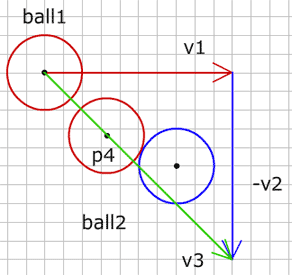

# 2 개의 움직이는 공 (2 Moving balls)

앞에서 한 개의 공을 자연스럽게 충돌시키는 방법을 익혔습니다. 
그런데 다른 공이 한 곳에 멈춰있지 않고 움직인다면 어떤 일이 벌어질까요? 
이런 경우 우리의 충돌은 실패할 수 있습니다. 몇가지 예시를 보세요.

공1이 빨강 벡터만큼 움직이고, 같은 시간 공2는 파랑 벡터의 크기만큼 움직입니다. 충돌을 올바르게 검출하고자 한다면 두 운동벡터를 같이 계산해야 합니다.

그림에서 두 공이 충돌할 때 공1이 p2에 도달하고 공2가 p3에 있습니다. 
충돌 위치를 벡터의 계산으로 구해보도록 하겠습니다.
두 움직이는 공의 충돌을 찾는 대신에, 공1의 운동벡터에서 공2의 운동벡터를 뺍니다.
그러면 지난 단계에서 움직이는 공과 움직이지 않는 공 충돌 방식을 사용할 수 있습니다.

공1 운동벡터에서 공2 운동벡터를 뺀, 공1을 시작 좌표로 하는 벡터 v3를 구합니다.

  
v3.p0 = ball1.p0;
v3.vx = ball1.vx - ball2.vx;
v3.vy = ball1.vy - ball2.vy;


이제 지난 단계에서 배운 충돌 계산을 수행하면, 공1은 벡터 v3만큼 움직이고 공2는 전혀 움직이지 않습니다. 
공이 충돌하면 공1은 점 p4 좌표에 있습니다. 공1의 운동벡터에서 그 점까지의 새로운 벡터 v4를 구합니다.

  
v4.p0 = ball1.p0;
v4.p1 = p4;     


여기서 v4 길이를 v3 길이로 나눈 변수 "t" 를 구할 수 있습니다.

  
float t = v4.length / v3.length;


변수 "t" 는 0 과 1 사이 입니다. 두 공이 같은 시간에 움직이고 있음을 알고 있기에, 다음과 같은 예상을 할 수 있습니다.

* 값이 1이면 공1이 끝점에 도달하였을 때 충돌이 일어납니다. 
* 값이 0이면 공들이 시작점에 있을 때 충돌이 일어납니다. 

충돌이 일어날 때 공들의 위치를 알아내기 위해서 그들의 운동벡터에 t 곱해야 합니다.

  
ball1.p1.x = ball1.p0.x + t*ball1.vx;
ball1.p1.y = ball1.p0.y + t*ball1.vy;
ball2.p1.x = ball2.p0.x + t*ball2.vx;
ball2.p1.y = ball2.p0.y + t*ball2.vy;


p4가 벡터 v3의 밖에 있는 것은 이번 운동 사이클 동안 충돌이 일어나지 않을 것이며, 과거에 일어났거나 미래에 일어날 것임을 의미합니다. 
우리는 지금 충돌에 대해서만 다룰 것이기에 벡터 v3 위에 p4가 있는 것에 대해 검사해야 합니다.

  
if(v4.length < v3.length && dotP(v4, ball1) > 0) {
  //collision
}


제가 두 공이 움직이는 예제를 만들었습니다:

<canvas data-processing-sources="../data/two_moving_balls.pde"></canvas>
<small>(소스파일 [pde](../data/two_moving_balls.pde)를 다운받을 수 있습니다.)</small>

공이나 벡터의 끝점들을 드래그할 수 있습니다.

 

-----

 

# 2 개의 움직이는 공을 반동시키기 (Bouncing 2 moving balls)

충돌위치가 발견된 이후 "Ball vs ball" and "Bounce" 단계에서 설명한 것처럼 그것들의 운동 벡터를 변경할 수 있습니다. 그런데 지금까지 오직 1개 공을 움직였고, 1개의 움직이는 공이 벽으로부터 같은 속도로 (단지 운동 방향이 바뀐 채) 반동했습니다. 두 공이 움직일 때, 그들의 움직임은 다른 공에 역시 영향을 주고 운동벡터 결과는 두 운동벡터로부터 다시 계산되어야 합니다.

반동은 두 공의 질량에 따라 달라집니다. 좀 간단히 만들기 위해 공들이 같은 질량을 갖고 있다고 가정합니다. 
이런 경우 두 공들은 중심점 사이의 벡터 방향 상에 있는 운동벡터의 요소를 교환합니다.

vc는 공들의 중심점 사이 벡터이고, vcn은 vc의 노말입니다. 이제 운동 벡터 v1 과 v2 를 vc와 vcn에 투영시킵니다.

v1은 v1a와 v1b 요소로 분리되고, 같은 방법으로 v2는 v2a와 v2b로 분리됩니다. 결과적으로 운동벡터를 구하기 위해 v1a와 v2a가 교환되어지고 공1은 v1b 와 v2a로부터 새로운 운동 벡터를 얻습니다. 반면 공2는 v1a 과 v2b로부터 새로운 운동을 만듭니다.

이런 방법으로 아래 예제에서 몇개 공들이 움직이고 반동합니다.

<canvas data-processing-sources="../data/bouncing_2_moving_balls.pde"></canvas>
<small>(소스파일 [pde](../data/bouncing_2_moving_balls.pde)를 다운받을 수 있습니다.)</small>

 
 
다음 : [Ball vs Arc]({{ "/ball_vs_arc/" | prepend: site.baseurl }})

