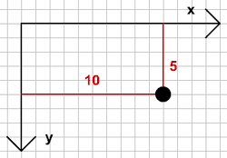
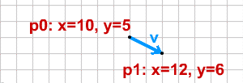

# 벡터, 이것은 무엇일까요?

우리가 어떤 게임을 만들려고 할 때, 화면에 오브젝트를 위치시키고 움직여야 했을 것입니다. 이미 알다시피, 화면에서 오브젝트는 x, y 라는 2차원 좌표값을 갖고 있습니다. 그래서 여러분은 화면 상의 지점 p를 아래와 같이 선언할 수 있습니다.


p = {x:10, y:5};


훌륭하죠, 1 줄로 "p" 라는 새 객체를 생성하고 선언 했을 뿐 아니라 "x", "y" 2개의 속성도 부여했습니다. 화면 상의 어느 한 지점을 포인트(Point)라고 합니다. 아래와 같은 방법으로 각각의 속성을 접근할 수 있습니다.


p.x
p.y


이제 포인트 객체 p 의 x 속성에 10을, y 속성에 5를 부여합니다. 그래픽 리소스를 만들어서 그 위치에 놓을 수 있을 것입니다.

대부분 컴퓨터는 우리가 흔히 알고 있는 y 축 좌표체계(위로 갈 수록 값이 높아지는)와는 반대로 아래로 갈수록 값이 올라가는 (반전된) 좌표축을 사용합니다.
이렇게, 우리는 1 개의 포인트를 만들고 그것이 어떻게 화면 상에 놓여지는지 알 수 있게 되었습니다. 

좀더 복잡한 내용으로 넘어가 봅시다. 2개의 포인트를 만듭니다.


p0 = {x:10, y:5};
p1 = {x:12, y:6};


여기서 우리는 자신도 모르게 이미 첫번째 벡터를 만들었습니다. 의아해 하지 않아도 됩니다. 벡터를 접한 사람들이라면 누구에게나 일어날 수 있는 지극히 당연한 반응입니다. 벡터는 "시작점"이라 부르는 포인트 p0 와 "끝점" 포인트 p1, 이렇게 2 개의 포인트로 만들어 집니다. 벡터는 방향성을 갖고 있음을 기억해야 합니다. 벡터 p0→p1 는 벡터 p1→p0 는 다릅니다. 이 2개의 벡터는 같은 길이와 같은 포인트를 갖고 있어서 매우 닮았지만 반대방향을 갖고 있기 때문에 같은 벡터라고 할 수 없습니다. 

우리가 처음 만든 것을 아래와 같이 선언합니다.


v = {
    p0:{x:10, y:5},
    p1:{x:12, y:6}
};


그리고 포인트를 이용해 벡터 v를 좌표평면에 그릴 수도 있습니다.

지금까지 너무 쉽지만 이게 끝이 아닙니다. 벡터 v는 시작점과 방향 속성으로도 정의될 수 있습니다. 잠시만요, 그렇다고 아직은 점 p1이 의미가 없다고 버려두진 마십시요. 나중에 사용될 것입니다. 그렇다면, 끝점 p1 없이 어떻게 벡터를 만들어 낼까요? 쉽습니다.


v = {
    p0:{x:10, y:5},
    vx:2,
    vy:1
};


>위치와 속도로 정의한 벡터의 기본 정의이다.

익숙한가요? 앞에서 만든 벡터와 정확히 같은 벡터입니다. 같은 시작점을 갖고 있으며, 2 값을 갖고 있는 vx 요소와 1 값을 갖고 있는 vy 요소를 만들었습니다. 이 벡터는 이렇게 말할 수 있습니다. "시작점 (x=10, y=5)에서 오른쪽으로 2칸 이동하고 아래로 1칸 이동한다". 직접 이동시켜보면 정확히 점 p1에서 끝나게 됨을 알 수 있습니다. 그리고, 모든 벡터 끝점은 벡터의 시작점과 vx, vy 요소로 계산하여 알 수 있습니다.

>여기서 vx, vy요소는 변화의 크기를 말한다. 결국 속도의 개념이다. 


v.p1 = {};
v.p1.x = v.p0.x + v.vx;
v.p1.y = v.p0.y + v.vy;


그리고 2개의 포인트로 벡터를 만들었다면, 언제든 벡터의 vx, vy요소를 알아낼 수 있습니다.


v.vx = v.p1.x - v.p0.x;
v.vy = v.p1.y - v.p0.y;


이로써, 우리가 어떤 벡터에 대해 얘기 할 때마다, 벡터는 2개의 포인트(p0, p1)을 갖고 있으며, 포인트 또한 x / y 좌표를 갖고 있고, 벡터도 vx / vy 요소가 있음을 알 것입니다.
이 벡터는 "빠르기", "속력", "운동량", "이동" 같이 비슷한 의미의 다양한 이름으로 불려집니다. 이런 이름들 때문에 혼란스러워하지 마세요. 단지 물체를 vx와 vy 방향으로 이동시킬 뿐입니다. 주의할 것은 단 하나, 벡터는 방향과 빠르기를 동시에 나타낸다는 것니다. 예를 들어 우리는 속력과 속도를 다르게 정의한다. 속력은 단지 빠르기만 나타낼 뿐이죠. 벡터는 속도를 표현하는 방식인 것입니다.

>

 
 
다음 : [Length. Normals]({{ "/length_normals/" | prepend: site.baseurl }})

